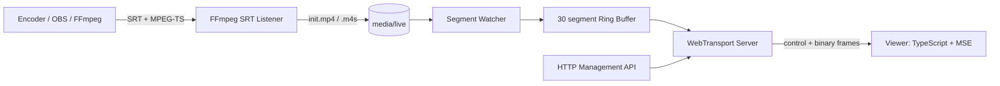

# アーキテクチャ

## 1. コンポーネント



## 2. サーバプロセス

実験では単一Pythonプロセスに以下を同居させる。

- HTTP管理API
- WebTransport endpoint
- ファイル監視
- リングバッファ
- 視聴セッション管理
- FFmpeg ingestプロセスの起動・停止・監視

SRTの受信、demux、必要な再エンコード、CMAF/fMP4生成はFFmpeg子プロセスが担当する。Python内ではSRTプロトコルやコーデック処理を実装しない。

データベースや外部メッセージブローカーは使わない。

## 3. データフロー

### 起動

1. 自己署名証明書を生成する。
2. Pythonサーバーを起動する。
3. FFmpeg ingestをSRT Listenerとして起動する。
4. EncoderがSRT Callerとして接続し、MPEG-TSを送信する。
5. FFmpeg ingestが一時ファイルへ書き込み、完成後にrenameする。
6. Watcherはrename後のファイルのみ取得する。
7. `init.mp4`を読み込む。
8. `.m4s`をsequence順でリングバッファへ登録する。
9. viewerが接続する。
10. サーバーが接続初期化情報とメディアを送る。
11. viewerがMSEへappendする。

### 新規セグメント

1. Watcherが完成済みファイルを検出。
2. ファイル名からsequenceを抽出。
3. 前sequenceとの差を確認。
4. リングバッファへ登録。
5. 全viewerの送信キューへ登録。
6. 各viewerへ独立したunidirectional streamで送信。

## 4. 並行処理

- Watcher: 1 task
- Viewer session: 1 session task / viewer
- Segment送信: 1 queue / viewer
- 最大queue長: 5 segment
- queueが5を超えた場合:
  - 古い未送信segmentを破棄
  - 最新の独立segmentから再開
  - `discontinuity`を送信

遅い視聴者が他の視聴者をブロックしない構成にする。

## 5. 状態

### Stream

```text
IDLE
WAITING_FOR_INGEST
STARTING
LIVE
INTERRUPTED
ENDING
ENDED
ERROR
```

### Viewer session

```text
CONNECTING
INITIALIZING
STREAMING
SLOW
CLOSING
CLOSED
```

### Player

```text
IDLE
CONNECTING
INITIALIZING
BUFFERING
PLAYING
CATCHING_UP
RECONNECTING
ENDED
ERROR
```

## 6. セキュリティ境界

WebTransportにはHTTPSと有効な証明書が必要である。ローカル実験では自己署名証明書をOSまたはChromeへ信頼させる。

初期実装では認証しない。`streamId`は固定値`live-001`とする。

## 7. 主要な設計制約

- マニフェストがないため、接続初期化情報は制御メッセージで渡す。
- 途中参加位置はサーバが決める。
- sequence欠落と不連続はサーバから明示する。
- MSEへappendする順番はクライアントが保証する。
- WebTransportの仕様・実装差分を隔離するため、transport層とplayer層を分離する。
