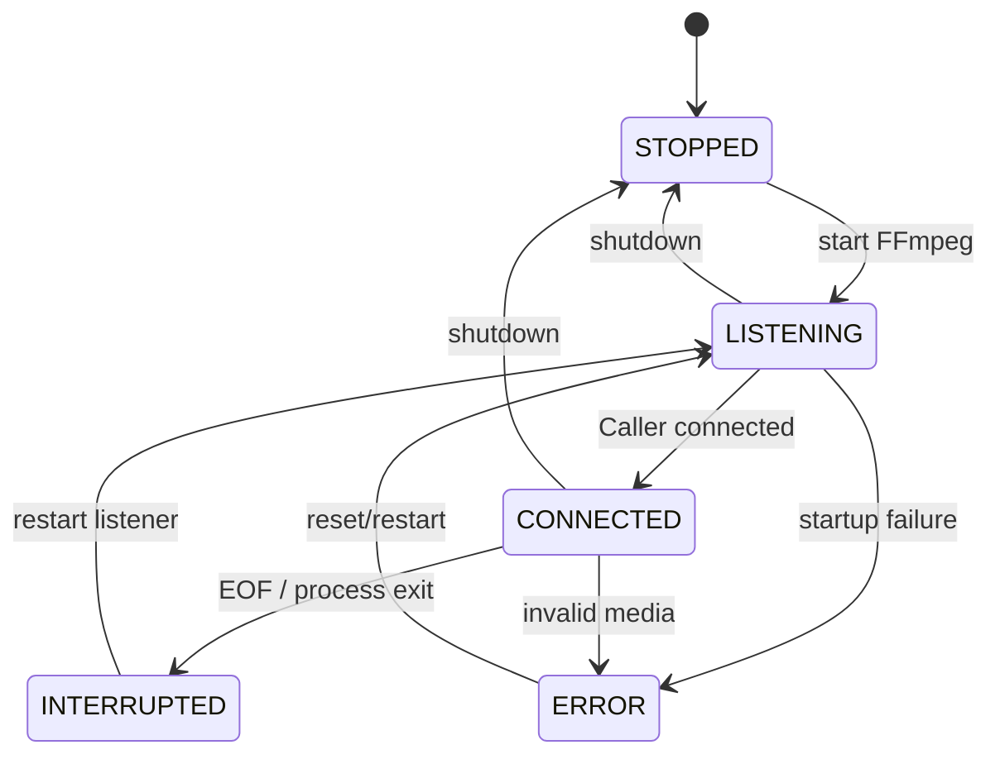

# SRT Ingest仕様

## 1. 接続

```text
Encoder:
  mode=caller
  destination=srt://server:9000
  payload=MPEG-TS

Server:
  mode=listener
  bind=0.0.0.0:9000/udp
```

SRT latencyの初期値は200msとする。

## 2. 対応入力

```text
Program: 1
Video track: 1
Video codec: H.264/AVC
Audio track: 1
Audio codec: AAC-LC
Container: MPEG-TS
```

## 3. 処理責務

### Encoder

- 映像・音声をエンコードする
- 1秒GOPを推奨する
- MPEG-TSへmuxする
- SRT Callerとして送信する

### FFmpeg ingest

- SRT Listenerとして待ち受ける
- MPEG-TSをdemuxする
- 入力codec・trackを検証する
- stream copyまたは再エンコードを選択する
- CMAF/fMP4 segmentを生成する
- stderrへ入力状態とエラーを出す

### Python server

- FFmpegプロセスを起動・監視する
- ingest stateを管理する
- segment outputを監視する
- 切断・再接続時にring bufferを初期化する
- viewerへdiscontinuityを通知する

## 4. 状態遷移



## 5. stream copy判定

以下をすべて満たす場合に`-c copy`を使用する。

- video codecがH.264
- audio codecがAAC
- video profile/levelがブラウザMSE対象内
- pixel formatがyuv420p
- GOPがおおむね1秒
- segment境界にIDRが存在する
- audio sample rateが48kHz
- timestampが単調増加する

判定不能または不一致の場合は再エンコードする。

## 6. 再接続

1. Caller切断を検知する。
2. stream stateをINTERRUPTEDへ遷移する。
3. viewerへdiscontinuityを通知する。
4. FFmpeg Listenerを再起動する。
5. 新しいCaller接続を受ける。
6. 古いsegmentとinitを削除する。
7. 新しいinitを待つ。
8. stream stateをLIVEへ戻す。
9. viewerはMediaSourceを作り直す。

再接続後の`initSegmentId`は`generation-byteLength-hash`形式とする。FFmpeg設定が同一でinit segmentのcontent hashが同じ場合も、generationを増やして新しいingest sessionとして区別する。

INTERRUPTED中に旧FFmpegプロセスが末尾segmentを書き切った場合、そのsegmentは新しい配信として公開しない。新しいinit segmentを検出してからring bufferを初期化し、media segmentの公開を再開する。

## 7. Docker

`compose.yaml`で次を公開する。

```yaml
ports:
  - "9000:9000/udp"
```

SRTはUDPを使用する。TCP portとして公開してはならない。

## 8. ログ

必須event:

```text
ingest_listener_started
ingest_connected
ingest_probe_succeeded
ingest_probe_failed
ingest_segmenting_started
ingest_disconnected
ingest_process_exited
ingest_restarting
ingest_error
```

## 9. 不正入力

入力検証は`ffprobe`でMPEG-TS内のtrackとcodecを確認する。検証完了前の不正入力は正常配信用のinit segment/media segmentとしてring bufferへ登録しない。

検出するエラーコード:

```text
VIDEO_TRACK_MISSING
AUDIO_TRACK_MISSING
UNSUPPORTED_VIDEO_CODEC
UNSUPPORTED_AUDIO_CODEC
```

検出時はingest stateとstream stateを`ERROR`または`INTERRUPTED`へ遷移し、`/api/ingest.lastError`へ`code`と`message`を設定する。次の正常なSRT Callerは受け入れ可能でなければならない。
