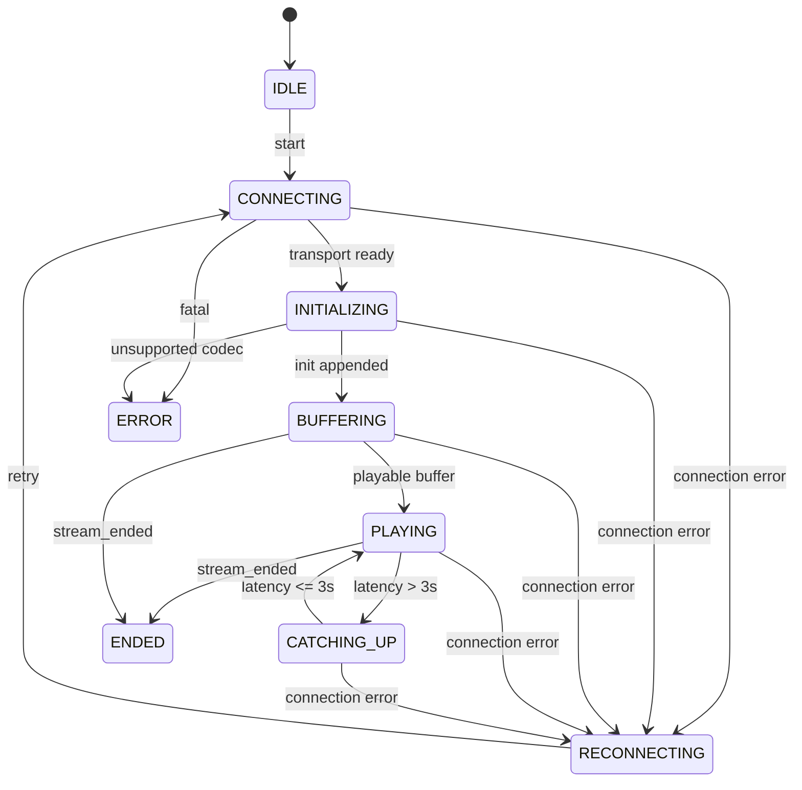

# プレイヤー仕様

## 1. モジュール

```text
TransportClient
  WebTransport接続、control/binary受信

ProtocolDecoder
  NDJSON、binary header解析

SegmentReorderBuffer
  sequence順序制御、欠落判定

MseController
  MediaSource、SourceBuffer、append/remove

LatencyController
  live edge、遅延、再生速度、seek

PlayerStateMachine
  状態遷移とUI通知
```

TransportとMSEを直接結合しない。

## 2. MSE初期化

1. `stream_init.mimeType`を受信。
2. `MediaSource.isTypeSupported(mimeType)`を検証。
3. MediaSourceを生成しvideoへ接続。
4. `sourceopen`後にSourceBufferを生成。
5. init segmentをappend。
6. media segmentをsequence順にappend。
7. 最低1.5秒buffer後に`video.play()`を試す。
8. autoplay拒否時は「再生」ボタンを表示する。

## 3. append queue

- `SourceBuffer.updating === true`の間はappendしない。
- `updateend`で次の操作を実行する。
- appendとremoveを同時に行わない。
- queue上限は10。
- 上限超過時は古いmedia segmentを破棄して最新独立segmentへ追従する。

## 4. バッファ削除

2秒ごとに実行する。

```text
removeEnd = currentTime - 5
```

`removeEnd > buffered.start(0)`の場合のみremoveする。

## 5. 遅延計算

```text
liveEdge = buffered.end(buffered.length - 1)
latency = liveEdge - video.currentTime
```

制御:

```text
latency > 5.0:
  currentTime = liveEdge - 2.5
  playbackRate = 1.0

3.0 < latency <= 5.0:
  playbackRate = 1.05

latency <= 3.0:
  playbackRate = 1.0
```

## 6. 状態遷移



## 7. 再接続

- backoff: 1, 2, 4, 8, 10, 10...秒
- 最大試行回数: 無制限。ただし`stream_ended`受信後は再接続しない。
- 再接続のたびにMediaSource、SourceBuffer、reorder bufferを破棄して再生成する。
- 古いWebTransport sessionの非同期処理はAbortControllerで停止する。

## 8. UI

必須表示:

```text
Connection: CONNECTED / RECONNECTING / CLOSED
Player: BUFFERING / PLAYING / CATCHING_UP / ENDED / ERROR
Sequence: 000123
Latency: 2.8s
Buffer: 3.2s
Viewers: 3 / 10
Error: -
```

デバッグパネルは常時表示でよい。デザイン品質は評価対象外。
