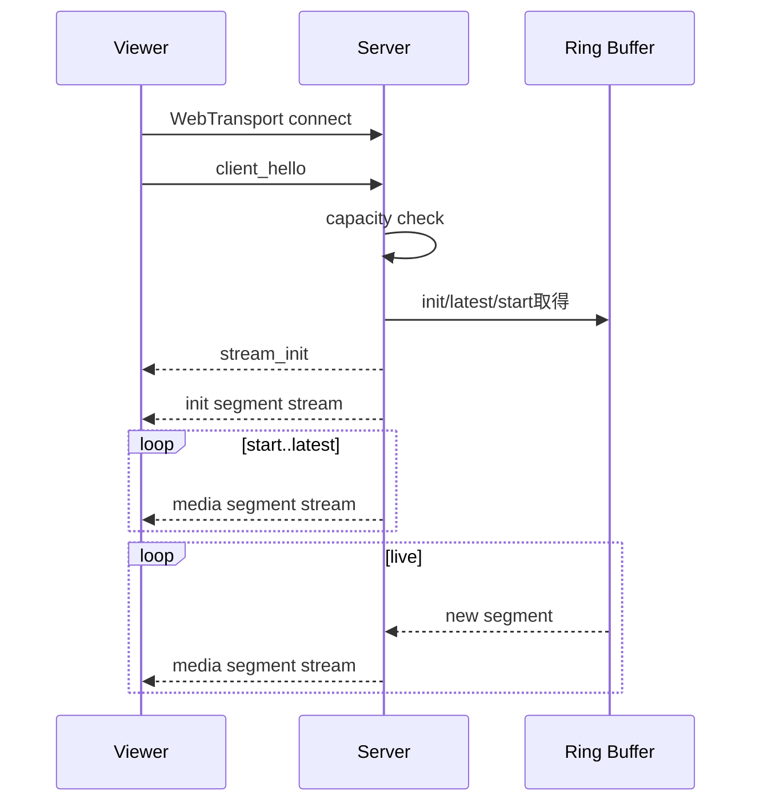

# WebTransportアプリケーションプロトコル

## 1. 方針

- WebTransport sessionを1 viewerにつき1本使用する。
- 制御メッセージは1本のbidirectional streamを使用する。
- init/media segmentはセグメントごとにunidirectional streamを使用する。
- datagramは使用しない。
- すべてのメディア転送はreliable streamとする。
- 整数はnetwork byte order（big endian）とする。

## 2. エンドポイント

```text
https://localhost:4433/webtransport/live-001
```

## 3. 制御ストリーム

1行1JSONのNDJSONとする。UTF-8でエンコードし、各メッセージ末尾にLFを付ける。

### client_hello

Client -> Server

```json
{
  "type": "client_hello",
  "protocolVersion": 1,
  "clientId": "uuid",
  "lastSequence": null
}
```

### stream_init

Server -> Client

```json
{
  "type": "stream_init",
  "protocolVersion": 1,
  "streamId": "live-001",
  "mimeType": "video/mp4; codecs=\"avc1.64001f,mp4a.40.2\"",
  "segmentDurationMs": 1000,
  "latestSequence": 120,
  "startSequence": 118,
  "initSegmentId": "3-1358-6f2510d0dbb2fcf3",
  "targetLatencyMs": 2500,
  "maxLatencyMs": 5000
}
```

`initSegmentId`は、ingest世代番号、init segment byte長、content hashを組み合わせた識別子とする。
SRT再接続時はcontent hashが同一でも世代番号を増やし、viewerが新しいMediaSourceを作成する判断に使用する。

### segment_available

必須ではない。メディアstream自体が通知になるため、デバッグ用途だけで送信可能とする。

```json
{
  "type": "segment_available",
  "sequence": 121
}
```

### discontinuity

```json
{
  "type": "discontinuity",
  "reason": "slow_consumer",
  "nextSequence": 125,
  "requiresNewInitSegment": false
}
```

### stream_ended

```json
{
  "type": "stream_ended",
  "lastSequence": 150
}
```

### capacity_exceeded

```json
{
  "type": "capacity_exceeded",
  "limit": 10
}
```

### error

```json
{
  "type": "error",
  "code": "STREAM_NOT_READY",
  "message": "init segment is not available"
}
```

## 4. バイナリstream形式

各unidirectional streamは次の形式とする。

```text
+----------------+----------------+----------------+----------------+
| magic 4 bytes  | version 1 byte | type 1 byte    | flags 2 bytes  |
+----------------+----------------+----------------+----------------+
| sequence 8 bytes                                                |
+-----------------------------------------------------------------+
| pts_ms 8 bytes                                                  |
+-----------------------------------------------------------------+
| duration_ms 4 bytes             | payload_length 4 bytes        |
+-----------------------------------------------------------------+
| payload ...                                                     |
+-----------------------------------------------------------------+
```

### magic

ASCII `MLSP`

### version

`0x01`

### type

- `0x01`: init segment
- `0x02`: media segment

### flags

- bit 0: independent segment
- その他: 0

### sequence

- init segment: 0
- media segment: 1以上

### pts_ms

- init segment: 0
- media segment: stream開始からの概算presentation timestamp

### duration_ms

- init segment: 0
- media segment: 原則1000

### payload_length

payloadのbyte数。上限10 MiB。超過時はprotocol errorとしてsessionを閉じる。

## 5. 接続シーケンス



## 6. 順序制御

QUIC stream間の到着順は保証しない。クライアントはheaderを読んだ後、sequence単位で一時保持し、期待sequence順にMSEへappendする。

- 最大並べ替え保持: 5 segment
- 期待sequenceが2秒以内に到着しない場合:
  1. 欠落sequenceを破棄
  2. 次のindependent segmentへ進む
  3. UIへ欠落を表示
- init segmentはmedia segmentより先にappendする。

## 7. 終了コード

アプリケーション終了コード:

- `0x100`: normal end
- `0x101`: capacity exceeded
- `0x102`: invalid client message
- `0x103`: stream not ready
- `0x104`: protocol version mismatch
- `0x105`: internal error
